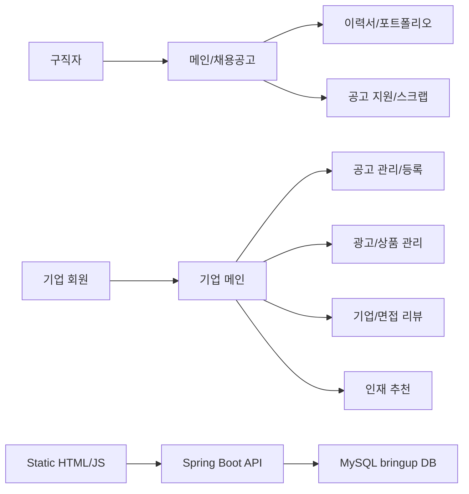
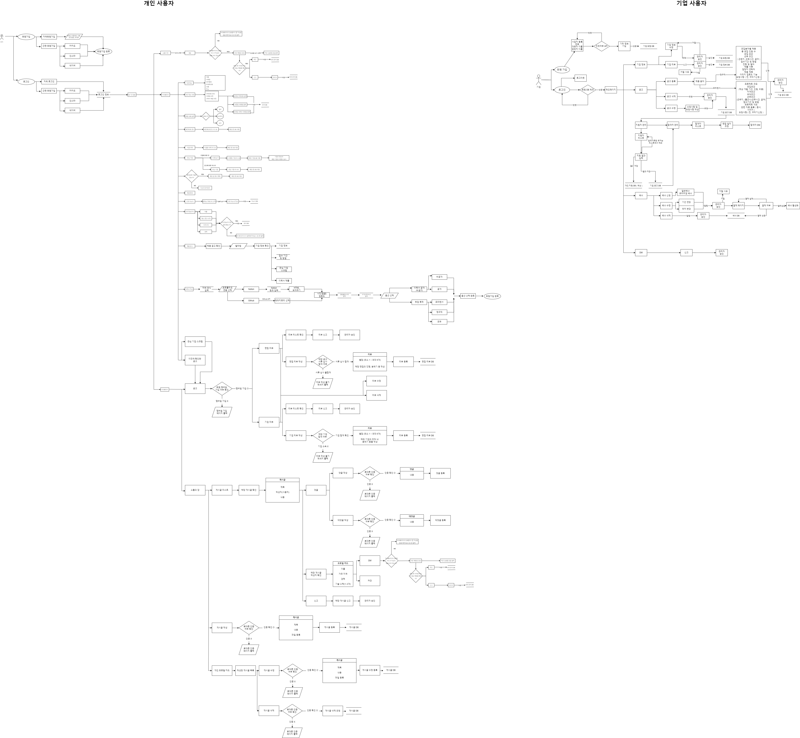
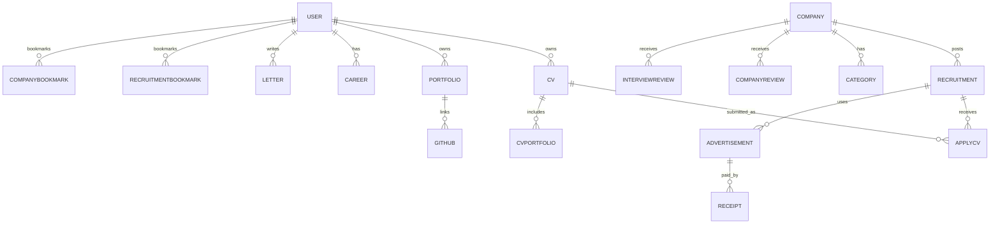

# 💼 Bring-Up - IT 기업 전용 구인구직 사이트

> 기업 회원 화면과 프론트엔드 구조를 중심으로 작업하였습니다.<br>
> 기업 메인/헤더/사이드 메뉴, 회원가입·로그인 화면, 정적 페이지 연결, 알림 드롭다운, 프론트-백엔드 연동 및 CORS/프록시 설정을 담당했습니다.

---

## 🛠 기술 스택

`Java 17` `Spring Boot 3.2` `Spring Security` `MyBatis` `MySQL` `Thymeleaf` `React` `HTML` `CSS` `SCSS` `JavaScript` `Gulp` `Bootstrap`

---

## 📁 담당 작업 내역

### 1. 기업 회원 프론트 구조 및 라우팅/페이지 연결

- 기업 메인 화면과 헤더, 카테고리, 사이드 메뉴 UI 구조 구현
- `react-router-dom` 기반 초기 기업 페이지 경로 구성 및 `.jsx` 파일 구조 정리
- 기업 메뉴에서 채용공고 관리/등록, 상품 관리, 추천, 리뷰 페이지로 이동하는 네비게이션 연결
- 정적 리소스 구조를 `static/company`, `assets/company_images` 등으로 정리

### 2. 기업 메인/헤더/공통 UI 구현

- 기업 메인 화면 콘텐츠와 타이틀/로고 이미지 정리
- 공통 헤더와 푸터 HTML 분리 및 여러 정적 페이지에서 재사용할 수 있도록 구성
- 로고 이미지, favicon, 다크모드 로고 리소스 정리
- 기업 회원 영역의 카테고리/사이드 메뉴 디자인과 인터랙션 구현

### 3. 회원가입·로그인 화면 및 연동

- 기업 회원가입 페이지(`company/auth/signup.html`) 생성
- 로그인 페이지(`signin.html`) 수정 및 로그인 endpoint 조정
- 프론트엔드와 Spring Boot 백엔드 연결 과정에서 경로, 타입, 요청 구조 수정
- 프록시/CORS 테스트와 CORS 설정 파일을 통해 로컬 연동 오류 해결

### 4. 알림 드롭다운 및 페이지 템플릿 구성

- 헤더 알림 드롭다운 이벤트와 `notification.js` 구현
- 채용공고, 상품, 리뷰, 추천 등 기업 관리 페이지 기본 템플릿 추가
- 정적 페이지에서 공통 include 흐름이 동작하도록 `includeHTML.js` 경로 수정

### 5. 프로젝트 정리 및 형상 관리

- `node_modules` 제거와 `.gitignore` 정리
- 템플릿/정적 리소스 이동, 파일 확장자 `.js` → `.jsx` 전환 등 구조 정리
- 팀 프로젝트용 Flow Chart와 README 기반 프로젝트 설명 정리

---

## 🚧 문제 상황과 해결

### 1. 프론트-백엔드 연동 시 CORS 오류

- **상황**: 로그인/테스트 API를 프론트에서 호출할 때 CORS와 프록시 설정 문제로 요청이 정상 처리되지 않았습니다.
- **해결**: `corsConfig.java`, 테스트 컨트롤러, `application.properties`, Gulp 프록시 설정을 조정하며 로컬 연동 구조를 맞췄습니다.
- **배운 점**: 프론트엔드와 백엔드가 분리된 구조에서는 API 경로, 포트, CORS 정책을 함께 설계해야 한다는 점을 배웠습니다.

### 2. 공통 헤더/네비게이션 중복과 페이지 연결 문제

- **상황**: 기업 페이지가 늘어나면서 헤더, 사이드 메뉴, 네비게이션 연결을 페이지별로 따로 관리하기 어려웠습니다.
- **해결**: 공통 헤더/푸터 파일과 include 흐름을 정리하고, 기업 관리 페이지들의 링크 구조를 한 번에 연결했습니다.
- **배운 점**: 여러 화면이 공유하는 레이아웃은 초기에 공통 컴포넌트처럼 분리해야 유지보수가 쉬워진다는 것을 경험했습니다.

### 3. 정적 리소스 경로와 로고 이미지 관리 문제

- **상황**: 로고, favicon, 이미지 파일이 여러 위치에 흩어져 있어 경로 수정과 화면 반영이 반복적으로 필요했습니다.
- **해결**: 회사 이미지 리소스를 `assets/company_images` 중심으로 이동하고, 헤더/메인/로그인 페이지의 참조 경로를 정리했습니다.
- **배운 점**: 정적 리소스는 기능 영역별로 폴더를 나누고, 참조 경로를 일관되게 관리해야 화면 깨짐을 줄일 수 있다는 점을 배웠습니다.

---

> 아래는 팀 전체 README입니다.

---

# Bring-Up

> 2024 Framework Team Project<br>
> IT 기업과 개발자 구직자를 연결하는 구인구직 웹 서비스입니다.

## 프로젝트 소개

Bring-Up은 IT 업계를 주요 대상으로 한 채용 플랫폼입니다. 구직자는 채용공고를 탐색하고 이력서/포트폴리오를 관리할 수 있으며, 기업은 채용공고 등록, 광고 상품 관리, 리뷰 확인, 인재 추천 흐름을 관리할 수 있도록 설계했습니다.

팀 프로젝트에서는 채용 서비스의 핵심 도메인을 직접 모델링하고, Spring Boot 기반 백엔드와 정적 웹 화면을 연결하며, MySQL 스키마와 화면 흐름도를 함께 구성했습니다.

## 주요 기능

### 사용자 영역

- 채용공고 조회 및 공고 스크랩
- 이력서, 자기소개서, 포트폴리오, GitHub 포트폴리오 정보 관리
- 기업 스크랩 및 기업/면접 리뷰 작성
- 공고 지원 내역과 멤버십 정보 관리

### 기업 영역

- 기업 회원가입 및 로그인 화면
- 기업 메인 대시보드, 공통 헤더/푸터, 사이드 메뉴
- 채용공고 관리/등록 페이지
- 프리미엄 공고, 광고 배너, 이력서 열람권 등 상품 관리 페이지
- 기업 리뷰/면접 리뷰 확인 및 인재 추천 페이지

### 공통/인프라

- Spring Boot 기반 API 서버 구성
- MySQL 기반 채용 도메인 스키마 설계
- Spring Security/JWT 인증 구조 설정
- CORS 설정 및 Gulp BrowserSync 프록시를 통한 로컬 프론트-백엔드 연동
- SCSS 컴파일, Bootstrap 기반 반응형 UI, 다크모드 리소스 구성

## 기술 스택

| 영역 | 기술 |
| --- | --- |
| Backend | Java 17, Spring Boot 3.2.4, Spring Web, Spring Security, MyBatis, JJWT, Lombok |
| Database | MySQL |
| Frontend | HTML, CSS, SCSS, JavaScript, Thymeleaf, Bootstrap 5 |
| Build/Tooling | Gradle, Gulp, BrowserSync, Sass, IntelliJ IDEA |
| Deployment Type | WAR packaging, embedded/local Tomcat development |

## 프로젝트 구조

```text
Bring-Up
├─ build.gradle
├─ bring_up.sql
├─ gulpfile.js
├─ imagefile/
│  └─ BringUp-FlowChart.png
└─ src/main
   ├─ java/
   │  ├─ com/bring_up/bringup/
   │  │  ├─ BringUpApplication.java
   │  │  └─ company/
   │  ├─ config/
   │  ├─ filter/
   │  └─ provider/
   └─ resources/
      ├─ application.properties
      └─ static/
         ├─ index.html
         ├─ signin.html
         ├─ company/
         └─ assets/
```

## 서비스 흐름



### 플로우차트 이미지



## DB 설계 요약

`bring_up.sql`에는 채용 플랫폼에 필요한 주요 도메인 테이블과 관계가 정의되어 있습니다.



## 실행 방법

### 1. 저장소 클론

```bash
git clone https://github.com/asowjdan/Bring-Up.git
cd Bring-Up
```

### 2. MySQL 데이터베이스 준비

`src/main/resources/application.properties`의 기본 설정은 아래와 같습니다.

```properties
spring.datasource.url=jdbc:mysql://127.0.0.1:3306/bringup
spring.datasource.username=bringup
spring.datasource.password=1234
```

로컬 MySQL에서 동일한 DB와 계정을 생성한 뒤 스키마를 적용합니다.

```sql
CREATE DATABASE bringup DEFAULT CHARACTER SET utf8mb4 COLLATE utf8mb4_unicode_ci;
CREATE USER 'bringup'@'localhost' IDENTIFIED BY '1234';
GRANT ALL PRIVILEGES ON bringup.* TO 'bringup'@'localhost';
FLUSH PRIVILEGES;
```

```bash
mysql -u bringup -p bringup < bring_up.sql
```

### 3. Spring Boot 실행

Windows 환경:

```bash
gradlew.bat bootRun
```

macOS/Linux 환경:

```bash
./gradlew bootRun
```

실행 후 `http://localhost:8080`에서 메인 화면을 확인할 수 있습니다.

### 4. 정적 리소스 개발 서버 실행

SCSS 컴파일과 브라우저 자동 새로고침이 필요할 경우 Gulp를 사용할 수 있습니다.

```bash
npm install
npx gulp
```

Gulp 개발 서버는 `http://localhost:8080`으로 프록시하도록 설정되어 있습니다.

## 주요 페이지

| 경로 | 설명 |
| --- | --- |
| `/index.html` | 서비스 메인 화면 |
| `/signin.html` | 로그인 화면 |
| `/company/auth/signup.html` | 기업 회원가입 화면 |
| `/company/main.html` | 기업 회원 메인 화면 |
| `/company/job_posting/management.html` | 공고 관리 |
| `/company/job_posting/registration.html` | 공고 등록 |
| `/company/product/management.html` | 상품 관리 |
| `/company/product/premium_job_posting.html` | 프리미엄 공고 상품 |
| `/company/review/corporation.html` | 기업 리뷰 |
| `/company/review/interview.html` | 면접 리뷰 |
| `/company/recommendation.html` | 인재 추천 |
